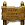
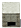

# Find Bunker Game

 

## 1. Introduction & Game Concept

**`Find Bunker Game`** is an simple aracade game that is one of my projects I created in my college, _NBCC_ (New Brunswick Community College).

## 2. Game Concept

In the near future, a nuclear-siren alarm is suddenly sounded in the city. A user has to find one of `bunkers` in a limited time in order to survive a incoming nuclear missile.


## 3. Installation

**`Find Bunker Game`** is made by `C++`. Installation is as follows.

- Need **Visual Studio**
- Install **SFML v2.5.1** - <a href="https://www.sfml-dev.org/download/sfml/2.5.1/" target="_blank">click here</a>

  - Dowload **`Visual C++ 15 (2017) - 32-bit`**
  - Expand and copy to `C:\SFML` in your computer

- Download **`Find Bunker Game`** here
- Open `FindBunker.sln` through **Visual Studio**
- Fix project property in **Visual Studio**
  - C/C++
    - Insert `C:\SFML\include` in `Additional Include Directories`
  - Linker
    - In `Genral`
      - Insert `C:\SFML\lib` in `Additional Library Directories`
    - In `Input`
      - Insert below in `Additional Dependencies`
        ```
        sfml-window-d.lib
        sfml-audio-d.lib
        sfml-network-d.lib
        sfml-system-d.lib
        sfml-graphics-d.lib
        ```
- Edit **System Environment Variables** in windows.

  - Click on the `Environmnet Variables` button, and then select and edit the `Path` environment variable. Add `C:\SFML\bin` to the `Path` environment variable.

- Run the game

## 4. Game Rule

-  - Find a `Sign Post` first. You cann't the location of all bunkers unless you see them in the `Sign Post`.
-  - Go to one of `bunkers` shown up in the game. When you reach the `bunker`, you realize that the door is locked.
- Search and grab the `key`, then go back to the `bunker`.

**Enter a bunker in a limited time.** _May God help you find your way._
